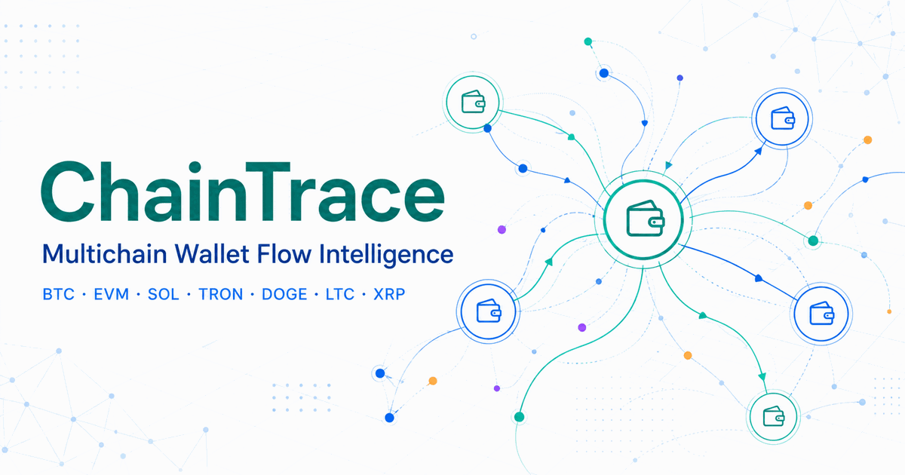

# ChainTrace

BTC, ETH, ETC, Solana, TRON, DOGE, LTC, XRP의 **지갑 입출금 연결을 1~3단계까지 추적하고 하나의 그래프로 조사하는 멀티체인 MVP**입니다.



## 지원 범위

| 네트워크 | 자산 | 체인 구조 | live provider |
|---|---|---|---|
| Bitcoin | BTC | UTXO | Tatum v4 |
| Ethereum | ETH, ERC-20 | EVM | Etherscan API V2 |
| Ethereum Classic | ETC, ERC-20 | EVM | ETC Blockscout |
| Solana | SOL, SPL | account/program | Helius `getTransfersByAddress` |
| TRON | TRC-20, 기본 USDT | account/contract | TronGrid |
| BNB Chain, Polygon, Arbitrum, Optimism, Base, Avalanche | native, ERC-20 | EVM | Etherscan API V2 |
| Dogecoin | DOGE | UTXO | Tatum v4 |
| Litecoin | LTC 투명 주소 | UTXO | Tatum v4 |
| XRP Ledger | XRP Payment | account/ledger | XRPL `account_tx` |

조사 화면은 API 키 없이도 14개 네트워크의 결정적 fixture를 전환해 볼 수 있습니다. 실제 온체인 조회는 아래 provider 설정이 필요합니다. UI 데모와 Rust API는 현재 별도 실행 구성입니다.

## 구현된 기능

- 체인·자산 선택, 주소 검색, 입금·출금 필터, 1~3 hop, 최소 금액
- UTXO, EVM, Solana, TRON, XRPL을 하나의 `ChainAddress`·`Transfer` 모델로 정규화
- Base58Check·Bech32 등 체인별 checksum/길이 검증과 EVM 20-byte 주소 형식 정규화
- `BigUint` 기반 원시 금액 보존과 체인·토큰별 decimals 처리
- provider registry를 통한 체인 family별 dispatch
- pagination, rate-limit/권한 오류, 부분 결과와 잘림 상태 처리
- Bearer 토큰 인증, 최대 노드·엣지·페이지·provider 조회 제한, 요청 처리 45초 deadline
- 프론트 렌더 계약과 Rust 도메인·provider·추적·API 단위 테스트

## 구조

```text
app/                    멀티체인 조사 화면
backend/src/
  domain.rs             체인·주소·자산·정밀 금액 공통 모델
  registry.rs           chain family provider dispatch
  tracer.rs             1~3 hop BFS 연결 그래프
  etherscan.rs          EVM native/ERC-20
  helius.rs             Solana SOL/SPL
  trongrid.rs           TRON TRC-20
  tatum.rs              BTC/DOGE/LTC UTXO
  xrpl.rs               XRP Payment
  api.rs                Axum HTTP API
tests/                  프론트 렌더링·소스 계약 테스트
.github/workflows/      프론트와 Rust 자동 검증
```

## 로컬 실행

### 조사 화면

```bash
npm ci
npm run dev
```

### Rust API

```bash
cd backend
cp ../.env.example .env
set -a
source .env
set +a
export CHAINTRACE_API_TOKEN="$(openssl rand -hex 32)"
cargo run
```

Provider 키:

```text
ETHERSCAN_API_KEY=      # Ethereum 및 지원 EVM 체인
ETC_BLOCKSCOUT_API_KEY= # Ethereum Classic; 비워도 공개 한도 내 요청 가능
TATUM_API_KEY=          # BTC, DOGE, LTC
HELIUS_API_KEY=         # SOL, SPL
TRONGRID_API_KEY=       # TRON, TRC-20; 비워도 공개 한도 내 요청 가능
XRPL_RPC_URL=https://s2.ripple.com:51234/
CHAINTRACE_API_TOKEN=       # 32자 이상의 무작위 서버 API 토큰(필수, 예제 값 없음)
```

- Etherscan V2의 BNB Chain, Base, OP Mainnet, Avalanche C-Chain은 현재 유료 플랜 대상입니다. [공식 지원 체인](https://docs.etherscan.io/supported-chains)
- Ethereum Classic은 공식 ETC Blockscout의 Etherscan 호환 REST API를 사용하며 API 키 없이도 호출할 수 있습니다. 높은 요청 한도에는 선택형 `ETC_BLOCKSCOUT_API_KEY`를 설정합니다. [ETC 네트워크·API 안내](https://ethereumclassic.com/build/networks), [Blockscout API 안내](https://docs.blockscout.com/devs/replace-links)
- Helius `getTransfersByAddress`는 Developer 플랜 이상이 필요하며 최근 1년 데이터만 보존합니다. ChainTrace는 1년보다 오래된 시작 시각을 upstream 호출 전에 거부합니다. [공식 메서드 문서](https://www.helius.dev/docs/rpc/gettransfersbyaddress)
- Tatum UTXO history는 BTC, LTC, DOGE를 지원합니다. [공식 UTXO history 문서](https://docs.tatum.io/reference/gettransactionhistoryutxosblockchainsapi)
- Ripple 공개 서버는 프로토타입용이며 지속적인 상업 트래픽에는 별도 provider 또는 자체 노드가 필요합니다. [XRPL 공개 서버 안내](https://xrpl.org/docs/tutorials/public-servers)

키는 브라우저에 넣지 않고 Rust 서버 환경 변수에만 보관합니다. 자동 테스트는 실제 provider 네트워크를 호출하지 않습니다.
`CHAINTRACE_API_TOKEN`도 브라우저 번들에 넣지 말고 신뢰된 서버나 CLI에서만 사용하세요.

## API

### BTC native 예시

```http
POST /api/v1/trace
Content-Type: application/json
Authorization: Bearer $CHAINTRACE_API_TOKEN
```

```json
{
  "chain": "bitcoin",
  "root_address": "1NXpPiMGYE6w3pEdCUiQ1xU9WNAYR9GQSC",
  "asset": { "kind": "native" },
  "direction": "both",
  "max_hops": 2,
  "min_amount_raw": "1000000",
  "min_timestamp": 1787500800000,
  "max_timestamp": 1787587200000,
  "limits": {
    "max_nodes": 250,
    "max_edges": 1000,
    "max_pages_per_address": 10
  }
}
```

BTC는 소수점 8자리이므로 `min_amount_raw: "1000000"`은 0.01 BTC입니다.

### EVM ERC-20 예시

```json
{
  "chain": "ethereum",
  "root_address": "0xb0e3201a3c1cefb260e007781f36fbe5bc1bf624",
  "asset": {
    "kind": "token",
    "symbol": "USDT",
    "contract_address": "0xdac17f958d2ee523a2206206994597c13d831ec7",
    "decimals": 6
  },
  "direction": "outgoing",
  "max_hops": 2,
  "min_amount_raw": "1000000",
  "min_timestamp": 1787500800000,
  "max_timestamp": 1787587200000
}
```

금액은 JSON 숫자가 아닌 문자열로 반환해 정밀도를 보존합니다. 응답에는 `chain`, `asset_symbol`, `complete`, `truncated`, `truncation_reasons`가 포함됩니다.
Ethereum Classic 요청은 `"chain": "ethereum_classic"`을 사용하며 native ETC와 ERC-20을 같은 형식으로 조회합니다.

## 검증

```bash
npm run lint
npm run typecheck
npm test
npm audit --omit=dev

cd backend
cargo fmt --all
cargo clippy --all-targets
cargo test
```

Rust 테스트 범위:

- BTC/DOGE/LTC Base58Check, EVM, Solana, TRON, XRP 주소 검증
- 체인별 native decimals와 임의 정밀도 원시 금액
- Etherscan native/ERC-20, Tatum UTXO, Helius SOL, TronGrid TRC-20, XRPL Payment mapping
- outgoing/incoming/both, hop·금액 제한, 순환·self-transfer 종료
- 이벤트 중복 제거, provider pagination 잘림, 결정적 그래프 정렬
- 멀티체인 API 요청, Bearer 인증의 `401`, 잘못된 주소·제한의 `422`, 느린 추적의 `504`

## 조사 결과 해석 시 주의

ChainTrace는 공개 온체인 거래의 **주소 간 방향성 연결 관계**를 보여주며 다음을 확정하지 않습니다.

- 지갑의 실제 소유자 또는 개인 신원
- 중간 지갑에서 다른 자금과 섞인 뒤 동일한 코인이 그대로 이동했다는 사실
- 라벨이 없는 주소의 범죄 연관성

특히 UTXO 거래는 여러 입력과 잔돈 출력을 포함할 수 있습니다. 현재 adapter는 input 금액 비율로 output을 배분하고 각 edge를 `attribution: proportional_heuristic`으로 표시합니다. 합계 중복은 막지만 소유권이나 실제 자금 흐름을 증명하는 방식은 아닙니다. 잔돈은 온체인 데이터만으로 일반 출력과 확정적으로 구분할 수 없으며, mixed-input·CoinJoin 거래의 출력 금액을 특정 입력 주소의 자금으로 단정하면 안 됩니다. Coinbase 입력과 Litecoin MWEB 비공개 전송은 현재 범위 밖입니다.

EVM native 조회는 Etherscan `txlist`와 `txlistinternal`을 각각 pagination한 뒤 병합하며, 일반 거래와 internal trace를 분리한 안정적인 event ID를 사용합니다. 실패했거나 값이 0인 internal row는 제외합니다. Etherscan token event와 TronGrid account 응답에 log index가 없을 때는 응답 필드 hash와 안정적인 occurrence 순번으로 합성 ID를 만듭니다. 동일 응답 안의 중복 전송은 보존하지만 receipt/event log의 실제 index를 대체하는 증거 ID는 아닙니다. Solana는 Helius가 제공하는 owner 기준 transfer를 사용하고, XRP는 성공한 XRP `Payment`의 `delivered_amount`만 정규화합니다. 토큰 mint/burn, EVM self-destruct 등 모든 balance effect, XRP issued currency, escrow·DEX·AMM 등을 포괄하는 회계 엔진은 아닙니다.

1~3 hop은 지정 기간의 **연결 그래프**이며 후속 단계의 시간 인과성이나 FIFO/비례 배분을 적용하지 않습니다. 증거 보고서에는 provider, 조회 시점, 체인 높이, event 식별 방식과 추정 여부를 함께 기록해야 합니다.

## 다음 단계

1. 프론트에서 Rust API를 호출하는 실시간 모드와 provider 상태 표시
2. EVM transaction receipt log와 state-diff 기반 balance effect 보강
3. UTXO wallet-owned change address/xpub 모델과 CoinJoin 경고
4. PostgreSQL 캐시, 조사 세션, CSV/PNG 증거 내보내기
5. 주소 라벨의 출처·신뢰도와 수동 검토 workflow
6. TON, Sui, Cardano 등 추가 family adapter
